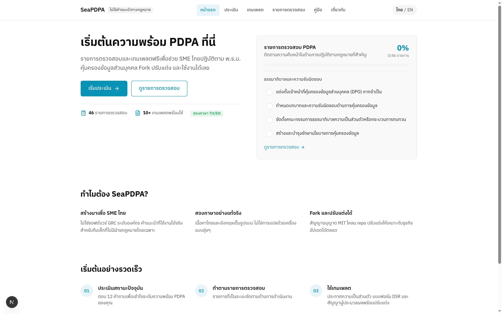
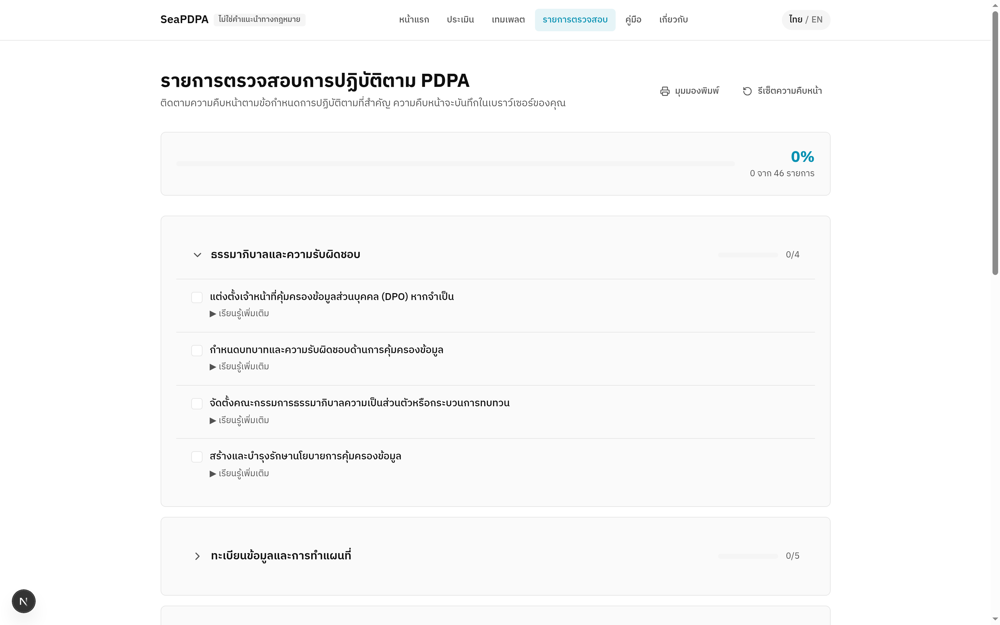

# SeaPDPA

**Bilingual PDPA Readiness Playbook for Thai SMEs**

Free, open-source checklists, templates, and guides to help Southeast Asian small and medium enterprises comply with Thailand's Personal Data Protection Act (PDPA). Fork it, adapt it, ship it.



## Features

- **Practical Checklists** — 45+ items organized by operational area (governance, data inventory, legal basis, security, breach response, etc.)
- **Ready-to-Use Templates** — Privacy notices, DSR request forms, data processing agreements, breach procedures in Markdown format
- **Interactive Assessment** — 12-question self-assessment to understand your PDPA readiness level
- **Bilingual Content** — Full Thai and English content, not machine-translated afterthought
- **Product-as-Landing** — Real checklist interface visible from the first scroll, not a marketing shell
- **Local-First** — Progress saved in localStorage, no account required, no data sent anywhere

## Quick Start

```bash
# Clone the repository
git clone https://github.com/OattyDev/seapdpa.git
cd seapdpa

# Install dependencies
npm install

# Start development server
npm run dev
```

Open [http://localhost:43127](http://localhost:43127) in your browser. Defaults to Thai (`/th`).

## Pages

| Route | Description |
|-------|-------------|
| `/th` or `/en` | Home — Product landing with live checklist preview |
| `/th/assess` or `/en/assess` | Assessment — 12-question interactive self-assessment |
| `/th/templates` or `/en/templates` | Templates — Downloadable privacy notices, DSR forms, DPAs |
| `/th/checklist` or `/en/checklist` | Checklist — Full operational checklist with progress tracking |
| `/th/guide` or `/en/guide` | Guide — PDPA explainers (law overview, roles, retention, breach) |
| `/th/about` or `/en/about` | About — Project info, disclaimer, license, contribute |

## Screenshots

### Home Page (Thai)


### Checklist Page (Thai)


## Tech Stack

- **Framework**: Next.js 16 (App Router)
- **Language**: TypeScript
- **Styling**: Tailwind CSS v4
- **Icons**: Lucide React
- **Font**: IBM Plex Sans Thai

## Design Principles

See [DESIGN.md](DESIGN.md) for the full design system documentation.

- Monochrome canvas + single cyan accent (`#0891B2`)
- IBM Plex Sans Thai for genuine Thai glyphs
- Hairline 1px borders, max 8px radius
- WCAG 2.2 AA compliant
- Respects `prefers-reduced-motion`
- No indigo gradients, glass morphism, glow blobs, or 48px icon grids

## Project Structure

```
src/
├── app/
│   ├── [locale]/           # Locale-based routing (th/en)
│   │   ├── page.tsx        # Home
│   │   ├── assess/         # Assessment
│   │   ├── templates/      # Templates
│   │   ├── checklist/      # Checklist
│   │   ├── guide/          # Guide
│   │   └── about/          # About
│   ├── globals.css         # Design tokens
│   └── layout.tsx          # Root layout with fonts
├── components/
│   ├── ui/                 # Primitives (Button, Card, Checkbox, etc.)
│   └── layout/             # Navigation, Footer, LanguageToggle
├── content/
│   ├── en/                 # English content
│   └── th/                 # Thai content
└── lib/
    ├── i18n.ts             # Internationalization utilities
    └── content.ts          # Content loading helpers
```

## Important Disclaimer

**This playbook provides general guidance only.**

SeaPDPA is an educational resource. It is not legal advice and does not create an attorney-client relationship. Every organization's situation is different.

- Use this as a starting point for understanding PDPA
- Adapt templates to your specific situation  
- Consult qualified legal counsel for binding legal advice
- Stay current with regulatory guidance from the PDPC

## Contributing

Contributions are welcome. Please:

1. Keep content practical and actionable
2. Avoid legal advice or guarantees
3. Maintain bilingual content (Thai and English)
4. Follow the existing style (see DESIGN.md)
5. Test your changes before submitting

## License

MIT License. See [LICENSE](LICENSE) for details.

---

Built with Next.js, TypeScript, and Tailwind CSS. Font: IBM Plex Sans Thai.
